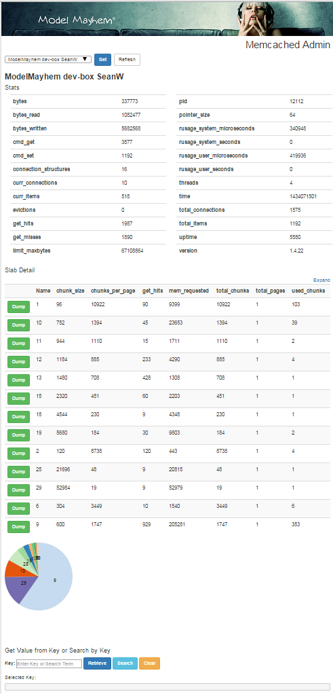

# Cacheadmin
---
"There are only two hard things in Computer Science: cache invalidation, naming things, and off-by-one errors." - Phil Karlton (1947-1997)

A client side web app to monitor and manage the cache layer of common Internet Brands websites. 

